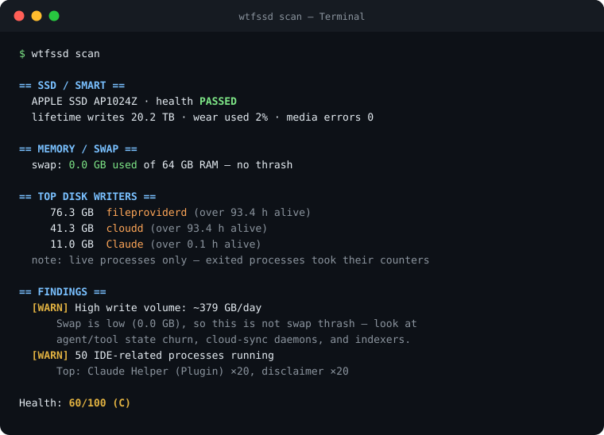

<div align="center">

<pre>
██╗    ██╗████████╗███████╗███████╗███████╗██████╗ 
██║    ██║╚══██╔══╝██╔════╝██╔════╝██╔════╝██╔══██╗
██║ █╗ ██║   ██║   █████╗  ███████╗███████╗██║  ██║
██║███╗██║   ██║   ██╔══╝  ╚════██║╚════██║██║  ██║
╚███╔███╔╝   ██║   ██║     ███████║███████║██████╔╝
 ╚══╝╚══╝    ╚═╝   ╚═╝     ╚══════╝╚══════╝╚═════╝ 
</pre>

### “Why is my Mac’s SSD busy / full / ‘dying’?”

**Measurements, not vibes.** A zero-dependency macOS CLI that finds what is
actually eating your SSD, names the processes doing it, cleans the
regenerable junk safely — and tells you plainly what it can and cannot know.




</div>

---

## The 30-second story

The internet said agentic IDEs were killing MacBook SSDs in three months.
The drives' own SMART counters said otherwise: **the NAND is fine — the
software environment is drowning it.** Swap thrash, ghost IDE helper trees,
chat databases with no retention, cloud-sync churn, indexer storms.

Gauges like DriveDx tell you the drive is healthy (“Issues found: 0”) on a
machine writing **379 GB a day**. `wtfssd` is the other half of the answer:
*who* is writing, *why* the machine feels bad, and *what to do* — without
ever asking for your password.

## Install

```sh
# Option A — real command (recommended)
brew install pipx && pipx ensurepath      # if you don't have pipx
git clone https://github.com/ogprotege/wtfssd.git && cd wtfssd
pipx install .

# Option B — no install, run from the clone
python3 -m wtfssd scan
```

Optional but worth it: `brew install smartmontools` for ground-truth SSD
wear numbers. Without it, everything else still works.

## Your first two minutes

```sh
wtfssd scan                        # 1. look — read-only, a few seconds
wtfssd clean                       # 2. dry-run — shows what COULD be freed, touches nothing
wtfssd clean cursor-caches --apply # 3. clean one safe thing — moves to Trash, not the void
wtfssd optimize ignore ~/my-proj   # 4. stop indexer churn at the source
```

Nothing is ever deleted without `--apply`, applied cleans go to **Trash**,
and running apps are guarded. Full ritual: [Manual §5](docs/MANUAL.md#5-your-first-10-minutes).

## What it does

| Pillar | What you get |
|--------|--------------|
| **Monitor** | SMART wear, swap pressure, free-space headroom, ghost IDE processes, agentic state growth, **top disk writers** (kernel per-process counters — Activity Monitor's source), backups, snapshots, crashes, churn, and more |
| **Alert** | Optional Notification Center pings — only when something is *new or worse*, with cooldowns |
| **Clean** | Dry-run-by-default reclaim of regenerable junk: IDE caches, chat-DB backups, DerivedData, stale `node_modules` |
| **Optimize** | `.cursorignore` generation, free-space floor tracking, one quiet hourly LaunchAgent if you want it |

Scan gears — use the lowest that answers your question:

| Gear | Command | Cost |
|------|---------|------|
| Micro | `wtfssd scan --micro` | ~0.1 s |
| Fast | `wtfssd scan --fast` | <1 s |
| **Full** | `wtfssd scan` | a few seconds |
| Bulk | `wtfssd scan --bulk-state` | + heavy tree sizing |

## The honesty contract

This tool's defining feature is saying what it knows *and what it doesn't*:

- **Never `sudo`.** No password prompts, ever. Root-only probes stay out of
  the product instead of half-working behind one.
- **`unknown` means “couldn't measure”** — never silently “fine.”
- **Write attribution names suspects, not verdicts** — live processes only,
  and the report says so in its own output.
- **Scan is read-only.** The only writes are its own history/metrics files
  (~KB), and `--no-history` makes even those zero.
- **It won't become the workload.** On-demand by default; the whole
  writers collector costs ~40 ms and ~0.5 MB, measured, per scan.
- Every capability has an explicit **CAN / CANNOT** table:
  [Manual §11](docs/MANUAL.md#11-how-thorough-is-a-scan-coverage--no-sudo).

## Safety model

1. `clean` without `--apply` **cannot** delete — dry-run is the default
2. Applied cleans move to **Trash**; permanent delete is an explicit `--hard`
3. Targets owned by a running app are **skipped** (override: `--force`)
4. High-risk targets are **backed up first**
5. Denylist: nothing outside your home; never Documents / Desktop / Photos
6. Read-only commands (`scan`, `watch`, `history`, `config`) stay read-only

## Documentation

| Read this | When |
|-----------|------|
| **[The Manual](docs/MANUAL.md)** | The full guide: first hour, decoding reports, cleaning without panic, coverage & claims tables, troubleshooting, FAQ |
| **[COMMANDS.md](COMMANDS.md)** | Every command, flag, clean target, and workflow |
| [AGENTS.md](AGENTS.md) | AI coding agents working on this repo |
| [CHANGELOG.md](CHANGELOG.md) | What changed, when |

## License

MIT

<div align="center">
<sub>Built because a healthy drive and a drowning machine are different problems — and most tools only check the first.</sub>
</div>
